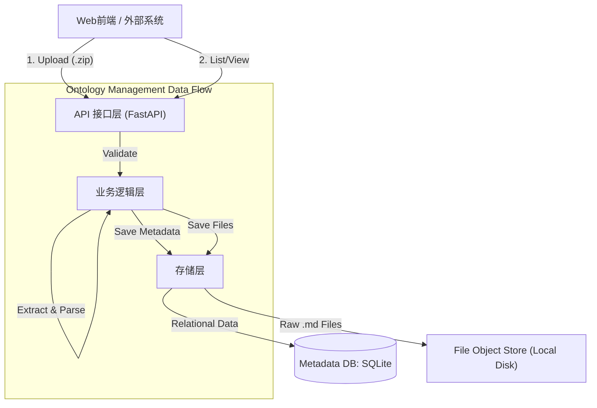

# 本体管理模块详细设计与架构审计

## 1. 现状回顾
原设计仅包含简要的功能点：查看、上传（Zip包包含MD）、删除。需补充具体的架构细节、安全措施及接口定义。

## 2. 系统架构 (System Architecture)

本模块作为独立服务或子模块运行，负责本体文件的生命周期管理。
**技术栈**: Python 3.10+, **FastAPI**, **SQLite**

### 架构图 (Mermaid)

## 3. 安全性审计 (Security Audit)

| 风险类别 (Risk Category) | 潜在威胁 (Threat) | 缓解措施 (Mitigation) |
| :--- | :--- | :--- |
| **恶意文件上传 (Malicious Upload)** | **Zip Slip 漏洞**: 恶意构造的 ZIP 包包含 `../../` 路径，解压时覆盖服务器关键文件。 | **强制与关键**: 解压时严格检查每个 Entry 的目标路径，确保其解析后位于目标解压目录之下。 |
| **拒绝服务 (DoS)** | **Zip Bomb (Decompression Bomb)**: 高压缩比的小文件解压后膨胀为巨型文件，耗尽磁盘或内存。 | 限制上传文件大小 (e.g., 50MB)；限制解压后的文件总大小与文件数量。 |
| **注入攻击 (Injection)** | **Filename Injection**: 文件名包含特殊字符干扰文件系统操作。 | 对上传文件名和解压内部文件名进行净化 (Sanitization)，仅保留安全字符。 |
| **XSS 攻击** | **Markdown XSS**: MD 文件中嵌入恶意 `<script>` 标签。 | 仅存储原始内容。前端渲染时必须使用 DOMPurify 或类似库进行清洗。接口层可添加 Content-Security-Policy 头。 |
| **越权访问 (Path Traversal)** | **Read Arbitrary Files**: 读取接口通过 `../../` 读取系统文件。 | 读取接口严格校验 `file_path` 参数，禁止包含父目录跳转符。 |

## 4. 详细设计 (Detailed Design)

### 4.1 存储架构说明 (Storage vs Database)

为了保持高效和灵活性，系统采用 **"元数据与实体分离"** 的存储策略：

1.  **数据库 (Database - SQLite)**:
    *   **存储内容**: 存储 "关于数据的数据" (Metadata)。例如：本体包的名称、上传者、上传时间、包含哪些文件、每个文件的层级结构、解析状态等。
    *   **作用**: 支持快速查询列表、搜索、管理状态。避免每次为了列出文件都要去扫描磁盘。
    *   **文件**: `ontology.db`

2.  **文件存储 (File Storage - Local Disk)**:
    *   **存储内容**: 存储 **实际的物理文件** (Raw Data)。即 ZIP 包解压后的 `.md` 文档本身。
    *   **作用**: 当用户需要阅读文档的具体内容时，系统根据数据库指引找到磁盘上的这个文件并读取内容。
    *   **位置**: `/data/ontology_storage/{uuid}/`

**关系**:
*   数据库中的 `ontology_file` 表记录了一个字段 `file_path` (例如 `concepts/user.md`)。
*   系统在读取时，将 `根目录` + `本体包ID目录` + `file_path` 拼接成完整的物理路径，读取磁盘内容。

### 4.2 数据模型 (Data Model - SQLite)

使用 SQLAlchemy 或 SQLModel 和 SQLite 存储元数据。

**Table: `ontology_package` (本体包)**
*   `id` (String/UUID): 主键，唯一标识
*   `name` (String): 本体名称 (通常为上传的文件名)
*   `description` (Text): 描述 (可选)
*   `upload_time` (Datetime): 上传时间
*   `status` (Enum): `UPLOADING`, `PROCESSING`, `READY`, `ERROR`
*   `error_msg` (Text): 错误信息 (如有)

**Table: `ontology_file` (本体文件)**
*   `id` (String/UUID): 主键
*   `package_id` (String/UUID): 外键 -> `ontology_package.id`
*   `file_path` (String): 在 ZIP 包内的相对路径 (e.g., `concepts/user.md`)
*   `file_size` (Integer): 文件大小
*   `content_preview` (Text): 内容摘要 (可选，用于快速预览)

### 4.3 接口定义 (API Interface - FastAPI)

遵循 RESTful 风格，使用 Pydantic 模型进行校验。

1.  **上传本体**
    *   **Method**: `POST /api/ontologies`
    *   **Input**: `file` (UploadFile, application/zip)
    *   **Process**:
        1.  FastAPI `UploadFile` 接收流。
        2.  生成 ID，保存临时文件。
        3.  解压并进行安全性扫描 (Zip Slip, Zip Bomb)。
        4.  提取 `.md` 文件，存入文件存储目录。
        5.  写入 SQLite 元数据。
    *   **Output**: JSON `{ "id": "uuid", "status": "processing" }`

2.  **获取本体列表**
    *   **Method**: `GET /api/ontologies`
    *   **Output**: List of `OntologyPackageSchema`

3.  **获取本体详情**
    *   **Method**: `GET /api/ontologies/{id}`
    *   **Output**: `OntologyPackageDetailSchema` (包含文件树)

4.  **读取文件内容**
    *   **Method**: `GET /api/ontologies/{id}/files`
    *   **Query Param**: `path` (relative path)
    *   **Output**: Pure Markdown String

5.  **删除本体**
    *   **Method**: `DELETE /api/ontologies/{id}`
    *   **Process**: 事务性删除 SQLite 记录及磁盘目录。
    
6.  **Webhook 管理 & 投递 (New)**
    *   **注册/管理**: `POST/GET/DELETE /api/webhooks`
    *   **查看日志**: `GET /api/webhooks/{id}/logs` 或 `GET /api/ontologies/{id}/deliveries`
    *   **投递机制**: 
        *   使用 Python `BackgroundTasks` 异步投递。
        *   Payload 格式: `multipart/form-data` (字段: `payload` JSON字符串, `file` ZIP文件流)。
        *   记录每次投递的 Response Status 和 Error Message。
        
7.  **本体更新 (Overwrite Logic)**
    *   **Trigger**: 上传同名文件 (Name check).
    *   **Process**:
        1.  检测到同名，标记 `is_updated=True`。
        2.  保留原 Database ID，更新 `upload_time`。
        3.  删除旧的 `OntologyFile` 记录和磁盘文件。
        4.  解压新 ZIP，重新生成 `OntologyFile` 记录。
    *   **Frontend**: 弹出确认框 -> 调用上传接口 -> 显示 "已更新"。

## 5. 前端架构 (Frontend Architecture)

*   **框架**: Vue 3 + Vite
*   **UI 组件库**: Element Plus
*   **关键组件**:
    *   `WebhookManager.vue`: 管理订阅列表，查看详细日志。
    *   `DeliveryStatusDialog.vue`: 轮询展示单次上传的 Webhook 推送进度。
*   **Markdown 渲染**: `markdown-it` + `github-markdown-css`。
