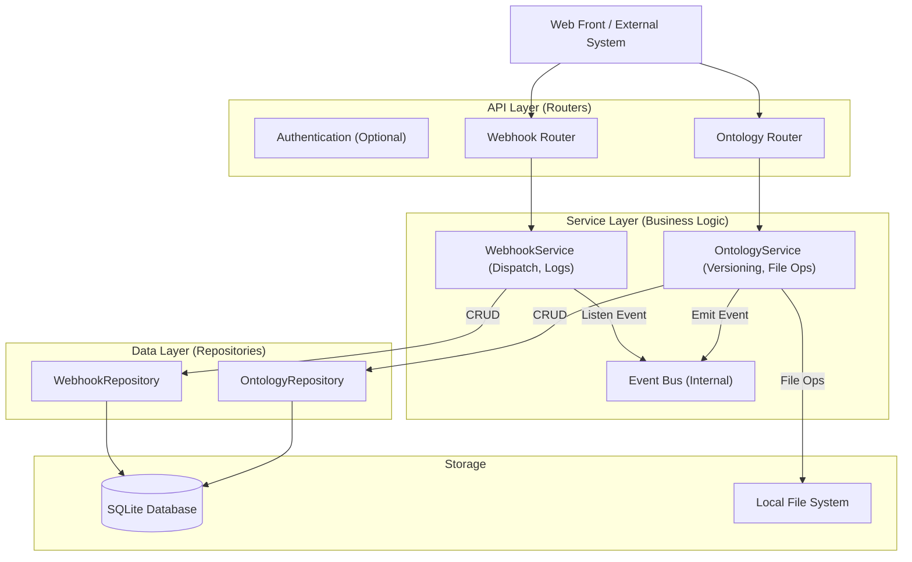

# OntoHub 系统架构设计文档

## 1. 系统概述 (Overview)
OntoHub 是一个企业级本体管理系统，核心目标是提供安全、版本化、可观测的本体模型分发服务。系统采用前后端分离架构，后端基于 FastAPI + SQLite，前端基于 Vue 3 + Element Plus。

## 2. 系统架构 (System Architecture)

### 2.1 分层架构 (Layered Architecture)
系统严格遵循 **Controller-Service-Repository** 分层模式，确保关注点分离。

### 2.2 核心模块说明
1.  **OntologyService**: 
    *   处理 ZIP 上传、解压、安全扫描。
    *   **版本控制**: 自动计算新版本号，管理 Active/Deprecated 状态。
    *   **删除保护**: 检查版本是否被 Webhook 订阅锁定。
2.  **WebhookService**:
    *   管理订阅者信息 (URL, Secret, Filter)。
    *   **异步分发**: 监听内部事件，使用 `BackgroundTasks` 或 `asyncio` 并发推送。
    *   **Payload 封装**: 组装 `multipart/form-data` (JSON Metadata + ZIP File)。

---

## 3. 关键特性设计 (Key Features)

### 3.1 版本控制模型 (Versioning Model)
系统采用 **系列 (Series) + 版本 (Version)** 的管理模式。

*   **唯一标识 (Series ID)**: 每个本体系列由唯一的 `code` (e.g., `auth-module`) 标识。
*   **唯一约束**: `(code, version)` 联合唯一。即使 `name` 发生变更，只要 `code` 相同，仍属于同一系列。
*   **状态机**:
    *   `READY`: 上传成功，等待启用。
    *   `ACTIVE`: 当前生效的主版本 (同一 `name` 只能有一个 Active 版本)。
    *   `DEPRECATED`: 历史版本，可读但不可变更。
*   **API 行为**:
    *   `GET /api/ontologies`: 分页返回**本体系列列表** (Series List)，每项包含最新版本信息。
    *   `GET /api/ontologies/{code}/versions`: 分页返回指定本体系列的**所有历史版本**。

### 3.2 不可变基础设施与删除约束 (Deletion Constraints)
为了保障下游系统的稳定性，系统实施了严格的**删除保护策略**：

1.  **Active Lock**: 正在被标记为 `Active` 的版本**禁止删除**。必须先激活其他版本（或无 Active 版本）才能删除。
2.  **Usage Lock**: 如果某个版本已经被 Webhook 成功推送给订阅者，且订阅者尚未更新到更新的版本，则该版本被视为**“正在使用中”**，禁止删除。

### 3.3 事件驱动分发 (Event-Driven Delivery)
*   **触发时机**: 当管理员调用 `POST /api/ontologies/{id}/activate` 接口时。
*   **事件名**: `ontology.activated` (替代旧的 `uploaded`)。
*   **Payload 结构 (Multipart)**:
    *   `payload`: JSON 字符串，包含 `id`, `name`, `version`, `description`, `upload_time`。
    *   `file`: 原始 ZIP 文件流。
*   **安全性**: 
    *   支持 `X-Hub-Signature` (HMAC-SHA256) 签名校验（Todo）。

---

## 4. 数据模型 (Data Design)

### 4.1 数据模型 (Data Design)
#### 4.1.1 OntologySeries (本体系列)
| 字段 | 类型 | 说明 |
| :--- | :--- | :--- |
| `id` | UUID | 全局唯一标识 |
| `code` | String | 本体唯一编码 (Business Key) |
| `name` | String | 本体显示名称 |
| `description` | Text | 全局描述 |
| `default_template_id` | UUID | 默认解析模板ID |

#### 4.1.2 OntologyPackage (本体版本)
| 字段 | 类型 | 说明 |
| :--- | :--- | :--- |
| `id` | UUID | 全局唯一标识 |
| `series_code` | String | 所属系列编码 (FK) |
| `version` | Integer | 版本号 (1, 2, 3...) |
| `is_active` | Boolean | 是否为当前启用版本 |
| `upload_time` | DateTime | 上传时间 |
| `status` | String | 状态: UPLOADING, PROCESSING, READY, ERROR |
| `error_msg` | Text | 错误信息 |
| `template_id` | UUID | 此版本使用的解析模板ID |

### 4.2 Webhook
| 字段 | 类型 | 说明 |
| :--- | :--- | :--- |
| `id` | UUID | 唯一标识 |
| `target_url` | String | 接收端 URL |
| `event_type` | String | 监听事件 (default: `ontology.activated`) |
| `ontology_filter` | String | (可选) 仅监听特定 **Code 或 Name** 的本体 |
| `secret_token` | String | (可选) 用于签名的密钥 |

### 4.3 WebhookDelivery
| 字段 | 类型 | 说明 |
| :--- | :--- | :--- |
| `webhook_id` | UUID | 关联的订阅者 |
| `package_id` | UUID | 关联的本体包版本 |
| `status` | String | SUCCESS, FAILED |
| `response_status` | Integer | HTTP 状态码 |
| `error_message` | String | 错误详情 |

---

## 5. 安全性设计 (Security)

1.  **Zip Slip 防护**: 在解压 ZIP 包时，严格检查 `zip_info.filename`，防止 `../../` 路径遍历攻击覆盖系统文件。
2.  **路径隔离**: 所有上传文件强制存储在 `backend/data/ontology_storage/{uuid}/` 目录下，物理隔离。
3.  **输入校验**: 使用 Pydantic (Schemas) 对所有 API 输入进行严格的数据类型和格式校验。
4.  **SQL 注入防护**: 使用 SQLAlchemy ORM，自动参数化查询，杜绝 SQL 注入风险。
